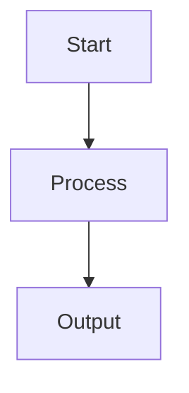

# Memory Agent

The `memory` agent plays a vital role in the AgentOS ecosystem.  
It operates independently and communicates via API and shared memory.

---

## Responsibilities

Describe what the `memory` agent does in your system.
For example:
- Accepts inputs from other agents
- Processes memory-related tasks
- Interfaces with services like databases, APIs, or voice

---

## Architecture


---

## Execution Flow



---

## Key Files

| File           | Description                  |
|----------------|------------------------------|
| `main.py`      | Entry point                  |
| `tests/`       | Unit tests                   |
| `logger.py`    | Log system                   |

---

## Sample Usage

```bash
curl http://localhost:800X/status
```

---

## Logs

```log
2025-04-01 10:01:02 | MEMORY INFO | Status checked
```

---

## Suggestions for Improvement

- Add full endpoint coverage
- Integrate with Scout for observability
- Add auto-repair routines
- Refactor for plugin support

---

## Status

| Metric         | Value     |
|----------------|-----------|
| Status         | ⬜ TBD     |
| Observability  | ⬜ Partial |
| Tests          | ⬜ Partial |

---

_This document is generated as part of the AgentOS automated documentation system._
