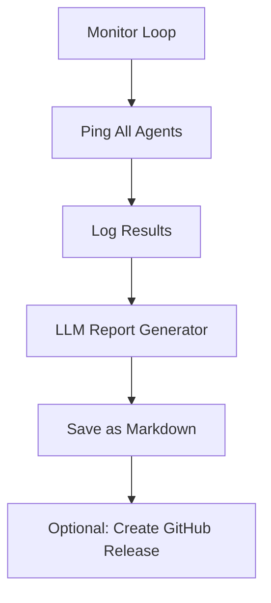

# 🕵️ AgentOS - Scout Agent

The Scout agent is the **watchdog** of the AgentOS ecosystem.  
It autonomously monitors the health of all other agents, logs activity, and generates intelligent reports using an LLM.

---

## Responsibilities

- Ping every agent via `/status` endpoint.
- Log results (`ok`, `fail`, `error`) with `loguru`.
- Generate markdown reports stored in `scout/reports/`.
- (Optionally) Suggest fixes, raise alerts or open GitHub PRs.

---

## Architecture Overview


---

## Execution Flow



---

## Key Files

| File               | Description                              |
|--------------------|------------------------------------------|
| `monitor.py`       | Main pinging and monitoring logic        |
| `llm_reporter.py`  | LLM-enhanced Markdown generator          |
| `reports/`         | Folder containing `.md` health reports   |
| `logger.py`        | Custom logging with `loguru`             |

---

## Sample Report Preview

```markdown
# AgentOS Health Report (2025-04-01)

## MEMORY
- Status: OK
- Detail: {'status': 'Memory operational'}

## TOOL_PROXY
- Status: ERROR
- Detail: Timeout during ping

> Suggestion: Investigate tool_proxy service timeout or add retry policy.
```

---

## Logs

```log
2025-04-01 10:05:22 | SCOUT INFO     | Scout is monitoring all agents...
2025-04-01 10:05:23 | API   OK       | {'status': 'ok'}
2025-04-01 10:05:24 | MEMORY OK      | {'status': 'operational'}
2025-04-01 10:05:24 | VOICE ERROR    | Connection refused
```

---

## Visual Components

- Logs: saved as `.log` and stdout
- Reports: `.md` format, timestamped
- Optionally: push reports to GitHub releases

---

## Suggested Enhancements

- Add Slack/Telegram alerts
- Add uptime % metrics per agent
- LLM auto-refactor for failing modules
- Push reports to Notion dashboard

---

## Image Resources

You can place visuals in `docs/images/` and reference them in any doc like:

```markdown

```

---

## Status

| Metric         | Value           |
|----------------|-----------------|
| Status         | ✅ Running      |
| LLM Connected  | ✅ Simulated    |
| Cron Schedule  | ⏱️ Manual run   |
| Tests          | ✅ Passed       |

---

_This agent is the heartbeat of the AgentOS. Without Scout, the city sleeps._

